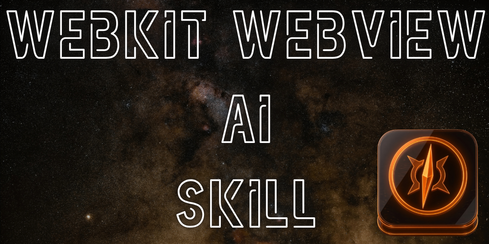
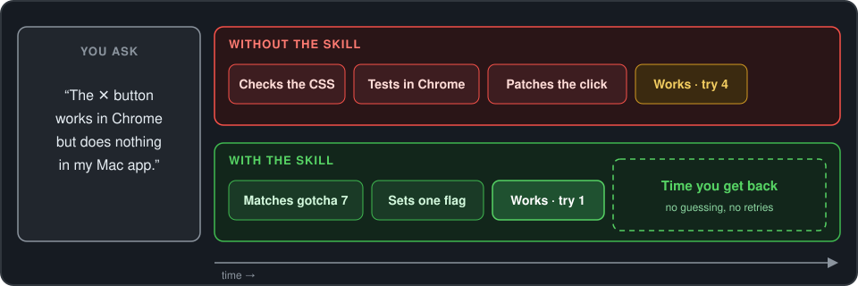

# 🧭🕸️ Webkit Webview Ai Skill Skill



> An AI skill trained to find and quash WKWebView and Chrome discrepancies.  

[](LICENSE.txt) [](https://github.com/anthropics/skills) [](https://github.com/adriangrantdotorg/webkit-webview-ai-skill/releases) [](https://github.com/adriangrantdotorg/webkit-webview-ai-skill/pulls)

---

## ⬇️ Why Install?

- 🎯 **Right fix on the first try** — the AI names the trap instead of guessing
- 🧪 **Proof under real WebKit** — headless checks that never show a window
- 💸 **$0 added cost** — it rides on the AI you already pay for
- 🧩 **Works for any WebKit shell** — Tauri, Swift wrappers, any web UI in a Mac app

| | 😩 Without this Skill | 😌 With this Skill |
| --- | :---: | :---: |
| 🐞 Known WebKit traps | what the AI half-remembers | **45, each with its fix** |
| 🔁 Tries until it works | 🧪 3–5 | **1** |
| ✅ Where a fix is verified | Chrome mock (can't fail) | **real WebKit** |
| 🔐 Windows or permission prompts while testing | 🧪 several | **0** |

<sub>🧪 estimate</sub>

---

## ✨ Features

Before touching code, the AI matches the symptom to a known WebKit trap, rules out its look-alike, and applies the tested fix.



- 🖱️ **Clicks and keys that just work** — swallowed first clicks, stuck focus, dead shortcuts, Escape eaten by autocorrect
- 🔬 **Offscreen WKWebView probe** — real WebKit clicks and keys, no window, no permission prompt
- 🖼️ **Images and links that load** — mixed content, blocked cross-origin images, the wrong browser opening
- 🔄 **Settings that reach every window** — per-window stores, pre-warmed windows, untracked SolidJS reads
- ✍️ **Native spelling and grammar** — squiggles on, the Mac spelling panel, a trimmed right-click menu
- ✨ **Redraws that never blink** — scroll, focus, media and animations survive a re-render

---

## 🚀 Installation

Needs an AI assistant that supports [Agent Skills](https://github.com/anthropics/skills). Clone into the folder for your platform:


---

```bash
# Claude Code
git clone https://github.com/adriangrantdotorg/webkit-webview-ai-skill.git ~/.claude/skills/webkit-webview-ai-skill
# Cursor
git clone https://github.com/adriangrantdotorg/webkit-webview-ai-skill.git ~/.cursor/skills/webkit-webview-ai-skill
# ChatGPT & Codex
git clone https://github.com/adriangrantdotorg/webkit-webview-ai-skill.git ~/.agents/skills/webkit-webview-ai-skill
```

| **Platform** | **Skills folder** |
| --- | --- |
| **[Claude Code](https://code.claude.com/docs/en/skills)** | `~/.claude/skills/` |
| **[Cursor](https://cursor.com/docs/skills)** | `~/.cursor/skills/` |
| **[ChatGPT & Codex](https://learn.chatgpt.com/docs/build-skills)** | `~/.agents/skills/` |

## 💡 Usage

Describe the symptom; the skill kicks in on its own.

| You say | The skill makes |
| --- | --- |
| "The search ✕ works in Chrome but does nothing in my Tauri app." | A **one-line config fix** (`acceptFirstMouse`) plus the tradeoff to watch |
| "Remote images are on, but some still show as broken." | A **diagnosis** (mixed content or a blocked cross-origin image) and the matching fix |
| "Prove this click handler works under real WebKit." | An **offscreen probe script** that clicks natively and reports pass, fail or hang |

---

<div align="center">
  <sub>Built with ❤️ for the WebKit and Mac app community & everyone shipping web UIs in native shells ✌🏾</sub>
</div>
